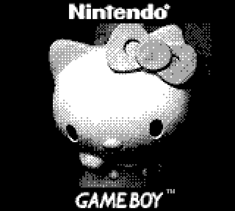

# GameBoy Camera/Pocket Camera Protocol

## Equipament used
- Gameboy Color (as primary device. All captured data refers to it) with GameBoy Camera cartridge
- Gameboy Advance (as secondary) with GameBoy Pocket Camera cartridge
- [NeoGB Printer](https://github.com/zenaro147/NeoGB-Printer) (to act as Gameboy Printer)

## Samples captured
- Print picture
- Album Full erros during transfer (as Sender and Receiver Hosting)
- Send Picture
- Receive Picture  (as Sender and Receiver Hosting)
- Cancelling Transfer (pressing B during the picture selection)

## Notes
- The sample contains all communications between the devices, including the confirmations.
- When the Receiver press A during the Transfer Method Selection (selecting if you want to Send or Receive a picture) the Receiver will select the pincture instead the Sender (downloading the Sender album data). The sender just need to confirm the transer after the Receiver select a Picture.
- All tests was made using this image as example 
